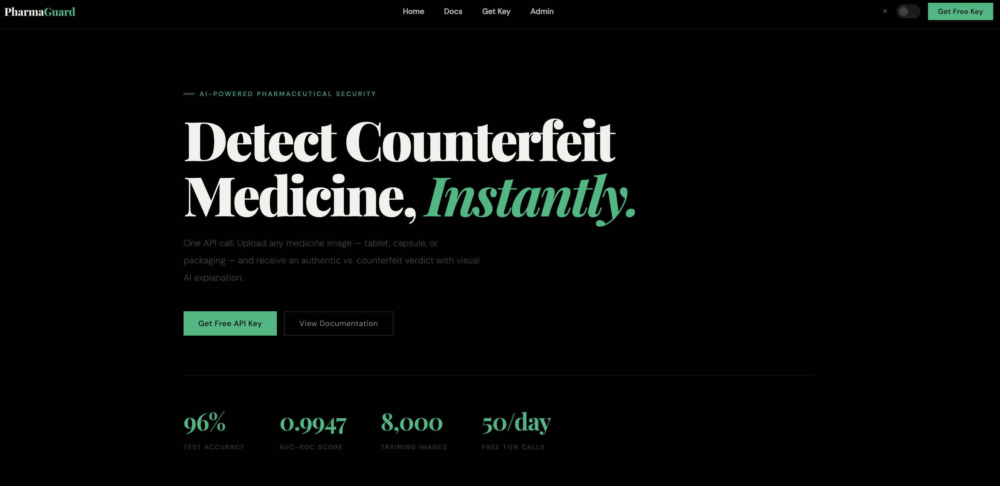
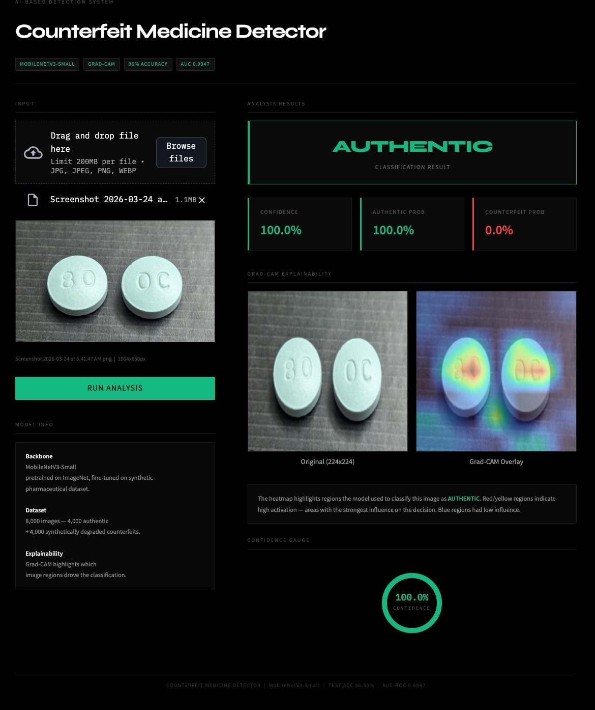
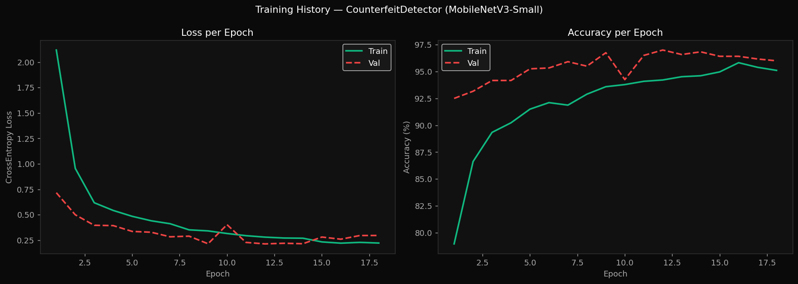
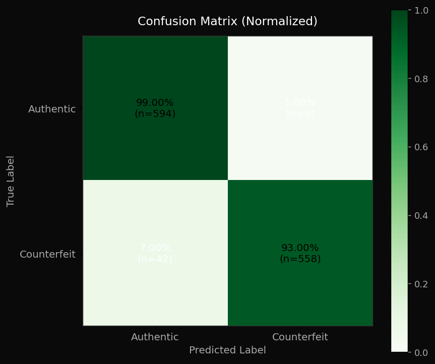
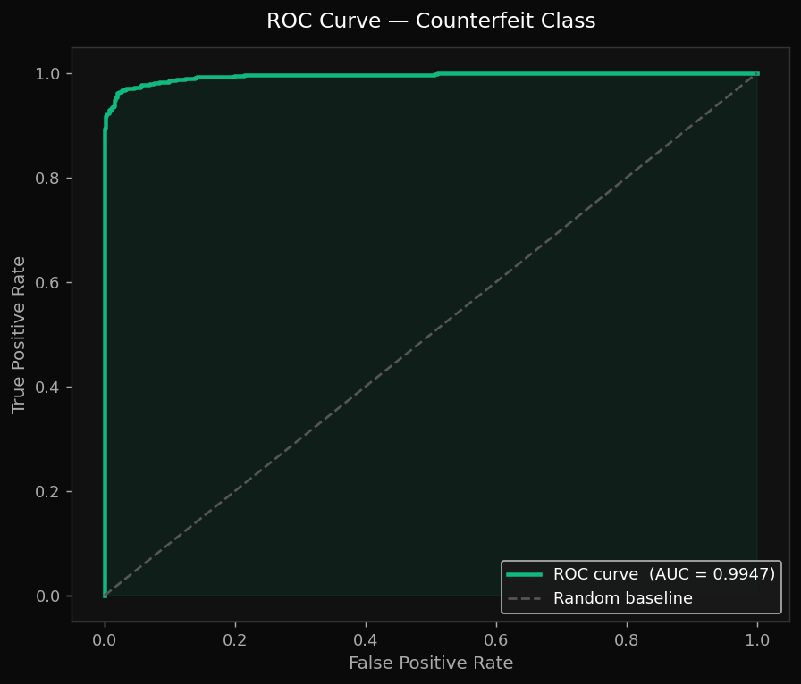
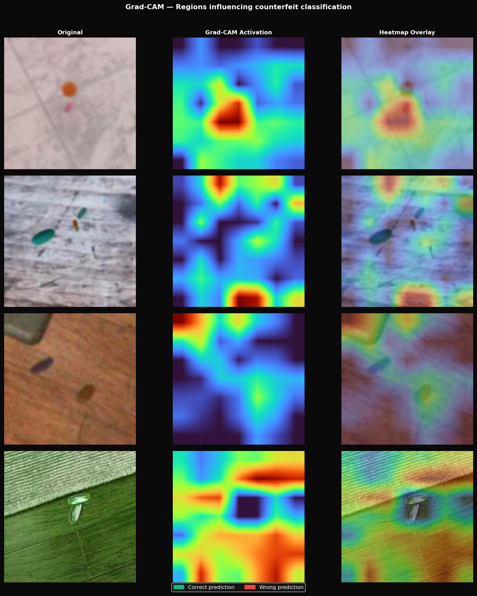
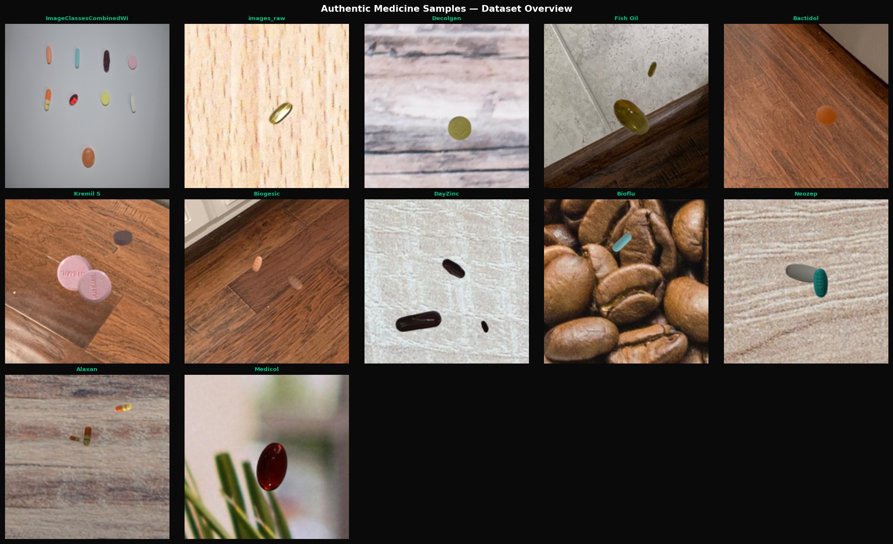
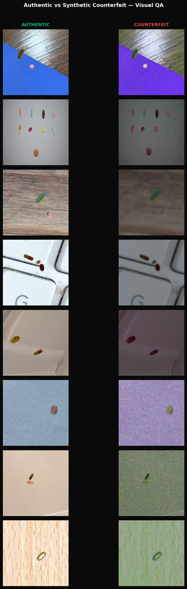
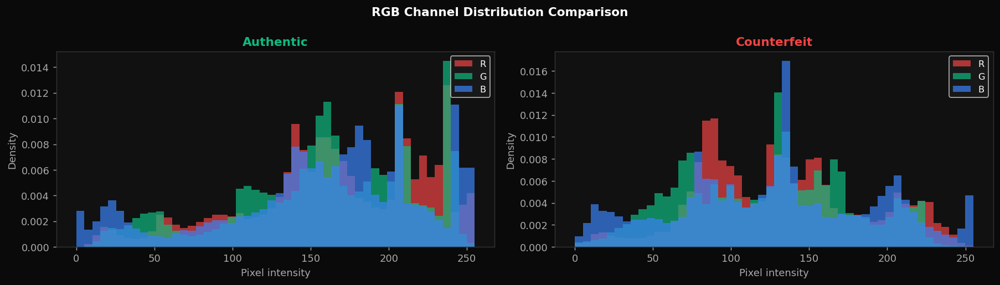

# PharmaGuard

<p align="center">
  <strong>AI-powered counterfeit pharmaceutical detection using computer vision, explainable AI, a Streamlit analyst app, and a production-ready Node.js API.</strong>
</p>

<p align="center">
  
  
  
  
  
</p>

## Overview

PharmaGuard is an end-to-end counterfeit medicine detection system built around a lightweight image-classification model, an explainability workflow, a locally usable Streamlit application, and a deployable API + admin dashboard.

The repository combines:

- a PyTorch training and evaluation pipeline
- ONNX export for inference serving
- a Streamlit app for analyst-facing predictions and Grad-CAM visualization
- an Express API for browser-based usage, key issuance, and admin operations
- MongoDB-backed API key storage for deployment-safe authentication

## Live Demo & Application Preview

<p align="center">
  <a href="https://pharma-counterfeit-detection-production.up.railway.app/" target="_blank">
    
  </a>
</p>

### Web Application

<p align="center">
  
</p>

### Streamlit Analyst Interface

<p align="center">
  
</p>

## Why This Project Matters

Counterfeit pharmaceutical products are a major public health risk. PharmaGuard is designed as a practical proof-of-concept for fast visual triage of tablets, capsules, packaging, and blister imagery with an emphasis on:

- fast classification
- interpretable predictions
- low-friction demos
- deployable serving infrastructure

## Highlights

- MobileNetV3-Small image classifier tuned for binary authentic vs counterfeit prediction
- Explainable AI with Grad-CAM overlays to show decision-driving regions
- Streamlit interface with upload, webcam, and mobile-camera-assisted workflows
- Public-facing website and admin panel served from the Node API
- MongoDB-backed API key management for production deployment
- ONNX model serving path for lightweight API inference

## Responsible Use Notice

PharmaGuard is a research and educational project developed for academic and demonstration purposes only.

The model is trained on publicly available datasets (including Kaggle sources) and may not generalize to real-world pharmaceutical scenarios. Predictions generated by this system should not be used for medical, regulatory, or commercial decision-making.

This project does not replace professional laboratory testing, regulatory validation, or certified pharmaceutical inspection processes.

Users are advised to treat all outputs as experimental and for learning purposes only.

## Results

Based on the checked-in evaluation outputs:

| Metric | Value |
| --- | ---: |
| Test Accuracy | 96.00% |
| Weighted F1 | 0.9600 |
| Weighted Precision | 0.9617 |
| Weighted Recall | 0.9600 |
| AUC-ROC | 0.9947 |
| Best Validation Accuracy | 97.00% |
| Best Checkpoint Epoch | 12 |

Source: [`outputs/predictions/test_results.json`](outputs/predictions/test_results.json)

## Visual Results

### Training Curves



### Confusion Matrix



### ROC Curve



### Grad-CAM Grid



### Sample Inference Visualization



### Additional Plot Assets

| Synthetic Comparison | Channel Comparison |
| --- | --- |
|  |  |

## Product Surfaces

### 1. Streamlit Analyst App

The Streamlit app lives in [`app/streamlit_app.py`](app/streamlit_app.py) and provides a focused diagnostic workflow with:

- image upload
- webcam capture
- mobile camera-assisted input via local network access
- confidence breakdown for both classes
- Grad-CAM heatmap overlays
- recent inference history

The app is optimized for local exploration, demos, and qualitative error analysis.

### 2. Web API + Admin Dashboard

The API service lives in [`api-server`](api-server) and serves:

- a browser-based frontend from [`api-server/public/index.html`](api-server/public/index.html)
- detection endpoints under `/v1/detect`
- registration and API key issuance under `/v1/auth`
- admin login, stats, and key management under `/v1/admin`

The current deployment-oriented backend uses:

- Express
- ONNX Runtime Web
- Sharp for image preprocessing
- MongoDB for API key persistence

## Repository Structure

```text
pharma-counterfeit-detection/
├── api-server/              # Node.js API, admin dashboard, Mongo-backed key storage
├── app/                     # Streamlit application
├── models/                  # PyTorch checkpoint + exported ONNX model
├── outputs/                 # Plots, predictions, Grad-CAM artifacts
├── src/                     # Training, evaluation, augmentation, data loading, model code
├── notebooks/               # Exploratory analysis
├── config.yaml              # Central experiment configuration
└── README.md
```

## Model Pipeline

### Training

Training is configured through [`config.yaml`](config.yaml) and executed from [`src/train.py`](src/train.py).

Current defaults include:

- image size: `224`
- train / val / test split: `70 / 15 / 15`
- backbone: `mobilenet_v3_small`
- dropout: `0.3`
- epochs: `25`
- learning rate: `3e-4`
- optimizer: `AdamW`
- scheduler: `CosineAnnealingLR`
- early stopping patience: `6`

### Evaluation

Evaluation is handled by [`src/evaluate.py`](src/evaluate.py), which generates:

- confusion matrix
- ROC curve
- weighted classification metrics
- saved JSON test metrics

### Explainability

Grad-CAM generation is implemented in [`src/gradcam.py`](src/gradcam.py) and produces both:

- per-sample visual explanations
- a stitched grid for presentation and inspection

### ONNX Export

Export to ONNX is handled by [`export_onnx.py`](export_onnx.py), producing:

- [`models/pharmaguard.onnx`](models/pharmaguard.onnx)

## Getting Started

### Python Environment

Install the Python stack:

```bash
pip install -r requirements.txt
```

Train the model:

```bash
python src/train.py
```

Evaluate the model:

```bash
python src/evaluate.py
```

Generate Grad-CAM outputs:

```bash
python src/gradcam.py
```

Run the Streamlit app:

```bash
streamlit run app/streamlit_app.py
```

## Example API Routes

### Health Check

```http
GET /v1/detect/status
X-API-Key: your_api_key
```

### Analyse an Image

```http
POST /v1/detect/analyse
X-API-Key: your_api_key
Content-Type: multipart/form-data
```

Form field name:

```text
image
```

### Register for a Public API Key

```http
POST /v1/auth/register
Content-Type: application/json
```

## Tech Stack

### Machine Learning

- PyTorch
- Torchvision
- NumPy
- scikit-learn
- OpenCV
- Grad-CAM
- Matplotlib / Seaborn

### Applications

- Streamlit
- Node.js
- Express
- ONNX Runtime Web
- Sharp
- MongoDB + Mongoose

## What Is Already Working

- model training
- evaluation and metrics export
- Grad-CAM visual explanations
- local Streamlit inference workflow
- API-based inference
- admin login flow
- MongoDB-backed API key persistence
- deployment-safe ONNX loading from the API service directory


## Author

Built by Abbas Ali Naqvi.